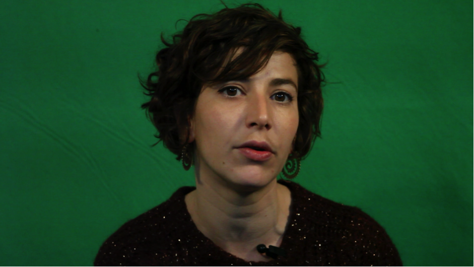

# Béatrice David

Béatrice David est consultante dans le secteur du numérique, ancienne directrice de Silicon Banlieue. Son interview a été réalisée pour la Biennale de Design de Saint-Etienne le 04 Février 2017 par Sylvia Fredriksson et Aurélien Marty.

J’ai fait mes premiers pas à la Cantine à Paris vers 2010. À l’époque consultante en stratégie numérique dans les télécoms, j'ai voulu m’intéresser à de nouveaux sujets. Ce qui a fait que j’ai poussé la porte, c’est notamment les formats assez ouverts de rencontrequi me permettaient d’aller de manière légitime à des événements sur des sujets sur lesquels je ne travaillais pas, et pour lesquels je n’avais pas un statut particulier. Mais ces formats très ouverts de rencontre, où tous les participants étaient invités à donner leurs avis et à contribuer, m’a effectivement permis de me sentir légitime. L’essai s’est transformé. J’ai très vite trouvé le moyen de me former et d’apprendre d’une manière très efficace et innovante.

De fil en aiguille, et suite à mon expérience à La Cantine à Paris, j’ai été recrutée pour lancer et gérer un tiers-lieu nommé Silicon Banlieue à Argenteuil. Ce tiers-lieu était un projet de Silicon Sentier, qui portait déjà la Cantine, et accompagnait l’agglomération d'Argenteuil-Bezons pour le développement d’un nouvel espace. Finalement, mes contributions aux multiples événements de la Cantine parisienne, et ma participation à la préfiguration du Numa sur les enjeux d’appropriation et de diffusion vers le grand public, m’ont porté à la direction de ce lieu là.

À Argenteuil, l'enjeu était de lancer un tiers-lieu avec coworking, ouvert au grand public et à différents types d’acteurs, dans un territoire qui n’était pas cette fois le Sentier à Paris, mais une banlieue avec un certain nombre de difficultés, et éloigné de Paris. L’intérêt que j’avais pour des problématiques d’inclusion sociale et d’inclusion numérique faisait écho à des enjeux qui allaient forcément se poser à Argenteuil.

J’aimerais travailler à un rapprochement des acteurs des tiers-lieux avec certaines communautés numériques, notamment des gens engagées, activistes numériques, militants avec l’univers très large des mouvements sociaux et des ONG, qui, je pense, peuvent utiliser de manière assez utile ce que peuvent apporter les tiers-lieux.

Que cela soit sur les méthodes de travail, par exemple les logiques d’horizontalité dans des univers où les gens vont pouvoir contribuer en apportant des compétences assez différentes, mises en commun, vont pouvoir servir une thématique que cela soit pour des outils techniques \(par exemple les data analystes sur les données de transparence des entreprises, transparence fiscale, transparence des États - il y a là un vrai besoin de croiser des compétences en terme d’analyse data, de traitement, de data viz, tout en ayant aussi cette culture de l’Open Data\) et des ONG qui vont travailler soit dans de la mobilisation auprès de citoyens, soit dans du plaidoyers, sur des sujets de transparence, de problématique de développement, de corruption.

C’est ce que j’ai vu comme croisement de compétences qui produisant des choses assez magique. J’aimerais amener cela dans des logiques de création de communauté.

