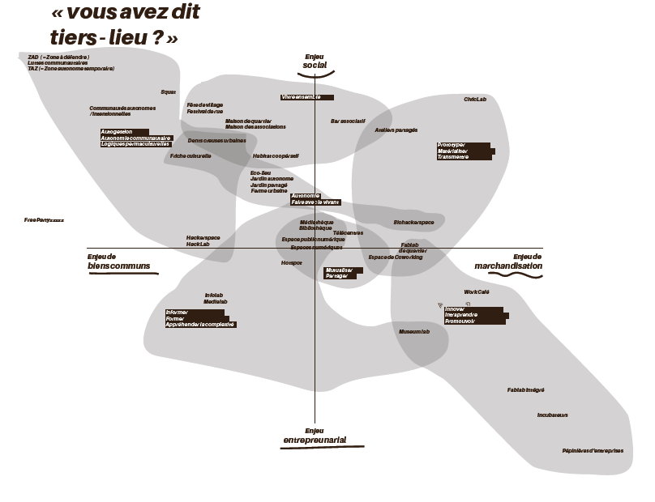

# Origines des Tiers-Lieux

Nés d'une approche sociologique de nos territoires, les "[Tiers-Lieux](http://fr.wikipedia.org/wiki/Tiers-lieu)" s’expriment en France \(et au delà\) depuis le début des années 2010. Ce sont des espaces physiques ou virtuels de rencontres entre personnes aux compétences variées qui n'ont pas vocation à se croiser. C'est lors des [rencontres d'Autrans en 2012](http://movilab.org/index.php?title=Les_rencontres_d'Autrans) que le rapprochement de [MoviLab](http://movilab.org/index.php?title=Wiki:Accueil) et des Tiers Lieux a donné naissance à [la communauté francophone des développeurs de Tiers Lieux Libres et Open Sources](http://coop-group.org/tiers-lieux/wakka.php?wiki=PagePrincipale) \(TiLiOS\). Devenue [marque collective](http://movilab.org/index.php?title=Marque_collective), Tiers Lieux s'écrit depuis toujours avec un T et un L majuscule ainsi qu'un X à la fin de Lieux. \(Source : [Movilab](http://movilab.org/index.php?title=Définition_des_Tiers_Lieux)\).

[Fichier source](https://drive.google.com/open?id=0B9tViCxWPKI9Vk13cEtLTDZZcnM) pour zoomer dans / remixer l'image. Origine : [Cartographie bêta des espaces hybrides et autres tiers-lieux](https://fr.wikipedia.org/wiki/Fichier:Cartographie_Espaces_hybrides_-_Prima_Terra_11_01_2016.jpg#file) \(Prima Terra l'Agence, [CC BY-SA 4.0,](https://creativecommons.org/licenses/by-sa/4.0/) 25 mai 2016\). Repris le 04 février 2017 par Sylvia Fredriksson et le collectif RDC.

