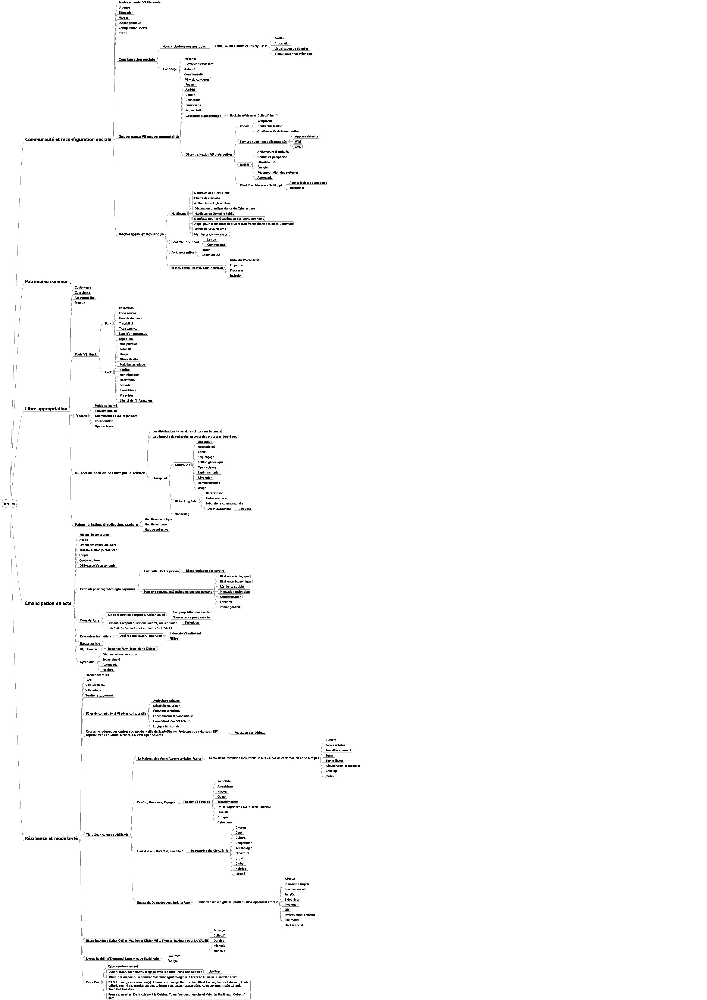

# Comprendre les Tiers-Lieux

Un des gros objectifs de la Biennale de Design était de "dévoiler" les processus Tiers-Lieux. Par suite, un travail - largement facilité par les designers du collectif RDC - a été de faire émerger les grandes propriétés communes à TOUS les Tiers-Lieux. En voici une première version. Elle n'est pas figée et se destiné à être éprouvé empiriquement par / avec les acteurs intéressés.

* Propriété 1 : [Configuration sociale](https://world-trust-foundation.gitbook.io/fork-the-world/intro-3/configuration-sociale)
* Propriété 2 : [Patrimoine commun](https://world-trust-foundation.gitbook.io/fork-the-world/intro-3/patrimoine-commun)
* Propriété 3 : [Libre appropriation](https://world-trust-foundation.gitbook.io/fork-the-world/intro-3/libre-appropriation)
* Propriété 4 : [Émancipation par le faire](https://world-trust-foundation.gitbook.io/fork-the-world/intro-3/emancipation-par-le-faire)
* Propriété 5 : [Résilience et modularité](https://world-trust-foundation.gitbook.io/fork-the-world/intro-3/resilience-et-modularite)

Ces propriétés ont permis de **structurer le propos** de l'expérience Tiers-Lieux de la Biennale. En voici la représentation **sous forme de** [**mindmap**](https://cloud.lamyne.org/s/LubBJiPKa738cAG) \(CC-BY-NC-SA\) réalisée par Sylvia Fredriksson dans le cadre de ses activités pour la Cité du Design. \(NB : l'image est délicate à lire ; cette [version PDF](https://cloud.lamyne.org/s/qfyQIJEU5FUecvX) est à votre disposition pour une exploration approfondie... préparant un fork\).

