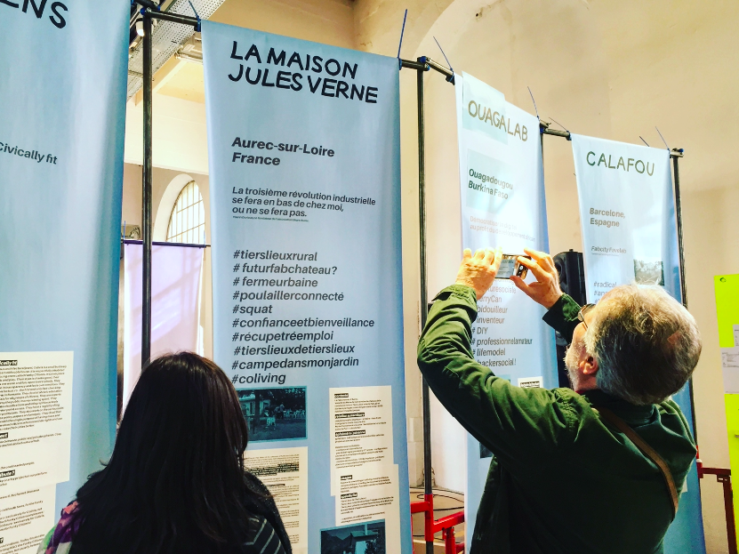

# Explorer les Tiers-Lieux

Cette section donne à voir des exemples de Tiers-Lieux à travers le monde, "sélectionnés" par la [_World Trust Foundation_](https://www.flickr.com/photos/sylviafredriksson/albums/72157678188984663) pour rendre compte de la richesse des Tiers-Lieux. Partageant un 'ADN' commun, ils affichent chacun de fortes singularités. L'objectif est bien entendu d'étendre cette sélection au gréé des adaptations et enrichissements du corpus éditorial Fork The World.

* Exemple 1 : [Jules Verne \(Aurec, France\)](https://world-trust-foundation.gitbook.io/fork-the-world/intro-4/maison-jules-verne)
* Exemple 2 : [Calafou \(Barcelone, Espagne\)](https://world-trust-foundation.gitbook.io/fork-the-world/intro-4/calafou-barcelone)
* Exemple 3 : [FunkyCitizen \(Bucarest, Roumanie\)](https://world-trust-foundation.gitbook.io/fork-the-world/intro-4/funkycitizen-bucarest)
* Exemple 4 : [Ouagalab \(Ougadougou, Burkina Faso\)](https://world-trust-foundation.gitbook.io/fork-the-world/intro-4/ouagalab-ougadougou)

